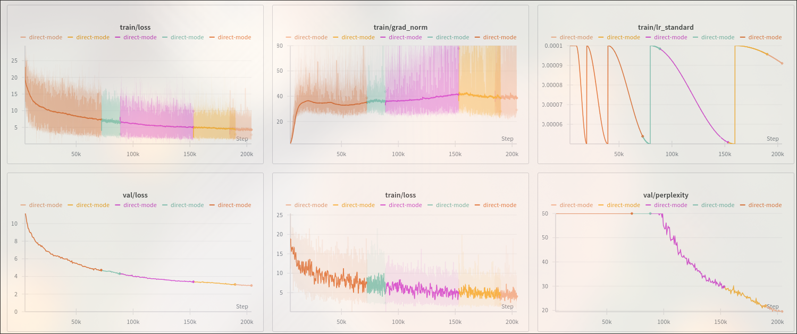

# RetNet Distillation Pipeline

A hackathon project focused on making next-generation recurrent architectures (RetNet) accessible and trainable on consumer hardware. While Transformers dominate the landscape, their O(N²) complexity limits context scaling. RetNet offers what the authors call the "impossible triangle": **O(1) inference, O(N) training, and competitive performance**.

## History & Pivot

This project began with a much more ambitious goal: **RheaNet**. The original vision was to fuse the "Memory-as-Context" architecture (Titans) with the retention mechanism of RetNet to create an "Infinite Context" agent without the "lost in the middle" issues. This was something I had half done before the hackathon.

However, the complexity of managing Titan's Neural Memory modules alongside the already-delicate distillation to RetNet recurrence led to a chaotic development cycle. Training stability was non-existent.

I made the hard call to pivot. I stripped the architecture down to a bare RetNet and focused entirely on the training loop. The result is this project: a robust, well-tested distillation pipeline for RetNet.

## Features

### 1. High-Performance Distillation Engine

The core of the project is a modular distillation system that supports three modes:
(VRAM is with out optimizer or additional allocations)
| Mode | Description | VRAM | Best For |
|------|-------------|------|----------|
| **Direct** | Teacher + student on same GPU | ~14GB | Fast iteration, single GPU |
| **Cached** | Pre-computed teacher logits from disk | ~9GB | Production training, reproducibility |
| **Network** | Teacher on separate vLLM server | ~9GB | Multi-node, large teachers |

- **Direct Mode**: Loads Llama-3.2-1B (teacher) and RetNet-500M (student) simultaneously. At 1K sequence length: **0.1s per optimizer step**. At 4K: **0.3s per step**.
- **Cached Mode**: Pre-compute teacher logits to disk, then train without teacher overhead.
- **Network Mode**: Offloads the teacher to a vLLM-compatible server with a custom `/v1/topk` endpoint for **100x faster** logit extraction.

### 2. Advanced Training Stability

Chasing down bugs in the original Titans implementation led to building a comprehensive system for detecting training pathologies:

- **Saddle Point Escape**: Automated detection when the model gets stuck in local minima, with interventions (LR spikes) to escape.
- **Muon Optimizer**: Integrated for superior RetNet performance vs AdamW. Uses Muon for 2D+ parameters, AdamW for 1D.
- **Diversity Regularization**: Custom loss components to ensure the student learns the distribution, not just the mode.

### 3. Production-Ready Infrastructure

- **Pre-tokenized Data Pipeline**: Custom `PretokenizedShardDataset` handles massive datasets with minimal RAM usage.
- **Fragmented Memory Fixes**: Custom PyTorch CUDA allocator configurations to prevent OOM during long runs.
- **WandB Integration**: Full telemetry for loss, gradient norms, evaluations, saddle detection, and memory usage.
- **Teacher Finetuning Pipeline**: **Critical for convergence.** Microsoft research shows 4.5× faster convergence when finetuning the teacher first. Without it, distillation on pure logits struggles to converge.

### 4. TorchScale Patch

RetNet is still experimental in TorchScale. This repo includes a patched version of TorchScale with necessary fixes for stable training.

## Training Metrics

The pipeline includes comprehensive WandB integration for real-time monitoring:



*Example training run showing loss curves, gradient norms, learning rate schedule, and performance metrics.*

## Quick Start

See **[QUICKSTART.md](QUICKSTART.md)** for the complete walkthrough.

**TL;DR:**

```bash
# 1. Install
git clone <repo-url> && cd retnet-distillation
pip install -e .

# 2. Download data (~5GB)
cd data && python download_curriculum_datasets.py --category instruction_chat

# 3. Tokenize
python preprocess_to_parquet.py \
    --input data/distillation \
    --output data/distillation_preprocessed \
    --recursive

# 4. (Strongly Recommended) Finetune teacher
python scripts/finetune_teacher.py --config configs/teacher_ft.yaml

# 5. Train!
python -m src.distillation.scripts.train --config configs/train_direct.yaml
```

## Architecture

The current model is a **500M parameter RetNet** trained on instruction-tuning data. By distilling from a finetuned Llama-3.2-1B-Instruct, we bypass the trillions of tokens usually required for pre-training and jump straight to a usable, instruction-following recurrent model.

**Model Variants:**
- `350M`: Lighter, faster training
- `500M`: Default, better quality (configured in `configs/train_direct.yaml`)

## Training Modes

### Direct Mode (Recommended for Single GPU)

```bash
python -m src.distillation.scripts.train --config configs/train_direct.yaml
```

- Loads both models on same GPU
- Fastest feedback loop, no network overhead
- Requires ~14GB VRAM (teacher 4GB + student 2GB + activations)

### Cached Mode (Best for Production)

```bash
# 1. Cache teacher logits
python scripts/cache_teacher_logits.py \
    --data-path data/distillation_preprocessed \
    --output-dir data/teacher_cache

# 2. Train from cache
python -m src.distillation.scripts.train --config configs/train_cached.yaml
```

- Pre-compute teacher logits once, reuse forever
- Reproducible training (exact same logits each epoch)
- Only ~9GB VRAM during training

### Network Mode (Multi-Node / Large Teachers)

```bash
# Terminal 1: Start vLLM server (on GPU machine)
python -m vllm.entrypoints.openai.api_server \
    --model meta-llama/Llama-3.2-1B-Instruct \
    --port 8080

# Terminal 2: Train (can be on different machine)
python -m src.distillation.scripts.train --config configs/train_network.yaml
```

- Decouples teacher from training process
- Scale to larger teachers (70B+) on separate hardware
- Custom `/v1/topk` endpoint for 100x faster logit extraction

See **[README_FAST_ENDPOINT.md](README_FAST_ENDPOINT.md)** for the custom vLLM endpoint setup.

## Configuration

All training configs are in `configs/`:

| Config | Mode | Use Case |
|--------|------|----------|
| `train_direct.yaml` | Direct | Default, single GPU training |
| `train_cached.yaml` | Cached | Production, reproducible |
| `train_network.yaml` | Network | Multi-node, large teachers |
| `teacher_ft.yaml` | - | Teacher finetuning |

Key parameters in `train_direct.yaml`:

```yaml
model_variant: "500M"           # Student size
max_seq_length: 1024            # Sequence length
teacher_model: "meta-llama/Llama-3.2-1B-Instruct"
teacher_topk: 512               # Top-k logits from teacher
distill_alpha: 0.5              # CE vs KL balance
```

## Project Structure

```
├── configs/                 # Training configurations
├── data/                    # Data scripts and storage
│   ├── download_curriculum_datasets.py  # Main data downloader
│   ├── preprocess_to_parquet.py         # Tokenization script
│   └── QUICKSTART.md                    # Data pipeline guide
├── scripts/                 # Utility scripts
│   ├── finetune_teacher.py  # Teacher finetuning
│   ├── cache_teacher_logits.py
│   └── evaluate_checkpoint.py
├── src/
│   ├── distillation/        # Core distillation code
│   │   ├── scripts/train.py # Main training script
│   │   └── dataset.py       # Data loaders
│   └── models/              # Model architectures
├── torchscale/              # Patched TorchScale (RetNet)
└── tests/                   # Test suite
```

## Legacy Code Notice

To preserve lessons from the original Titans/RheaNet exploration, this repository still contains legacy modules (for example under `src/models/hrm/` and the `tests/titans/` suites). These files are **not** part of the current distillation pipeline but remain for reference. When extending the project, focus on the RetNet distillation paths documented above and treat the Titans/HRM code as archival.

## Requirements

- **Python**: 3.10 or 3.11
- **GPU**: NVIDIA with ≥16GB VRAM (24GB+ recommended)
- **CUDA**: 11.8+
- **HuggingFace Token**: Required for Llama models

## License

MIT License. See LICENSE file.

The bundled TorchScale library is also under MIT License (Copyright Microsoft Corporation).

## Acknowledgments

- Microsoft TorchScale team for the RetNet implementation
- The knowledge distillation research community (MiniLLM, NeMo-Aligner)
- The Titans paper authors for the original inspiration

---

**Happy Distilling!** 🚀


